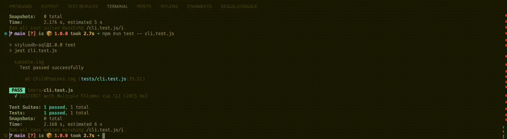

## Step 19: CLI Integration
### 19.1 Create a Basic CLI for the SQL Engine
We'll use Node.js to create a simple CLI that takes SQL commands as input and displays the results. Node's `readline` module can be used for input, and console logging can display the results.

- *Setup a New CLI File*: Create a new file `cli.js` in your project.
- *Implement Basic Command Line Interface*:

Example implementation in cli.js:

```javascript
const readline = require('readline');
const { executeSELECTQuery, executeINSERTQuery, executeDELETEQuery } = require('./queryExecuter');

const rl = readline.createInterface({
    input: process.stdin,
    output: process.stdout
});

rl.setPrompt('SQL> ');
console.log('SQL Query Engine CLI. Enter your SQL commands, or type "exit" to quit.');

rl.prompt();

rl.on('line', async (line) => {
    if (line.toLowerCase() === 'exit') {
        rl.close();
        return;
    }

    try {
        // Execute the query - do your own implementation
    }catch (error) {
        console.error('Error:', error.message);
    }

    rl.prompt();
}).on('close', () => {
    console.log('Exiting SQL CLI');
    process.exit(0);
});
```

- *Running the CLI*: Users can run this CLI by executing node cli.js in their command line `node src/cli.js`.
It should look something like this:

    

- *Interacting with the CLI*: Users can type SQL commands directly into the CLI. The CLI will then use the appropriate function (`SELECT`, `INSERT`, or `DELETE`) to execute the command and display the results.

### 19.2 Make sure the following test passes

Create this test in a file called `tests/cli.test.js`

```javascript
const child_process = require('child_process');
const path = require('path');

test('DISTINCT with Multiple Columns via CLI', (done) => {
    const cliPath = path.join(__dirname, '..', 'src', 'cli.js');
    const cliProcess = child_process.spawn('node', [cliPath]);

    let outputData = "";
    cliProcess.stdout.on('data', (data) => {
        outputData += data.toString();
    });

    cliProcess.on('exit', () => {
        // Define a regex pattern to extract the JSON result
        const cleanedOutput = outputData.replace(/\s+/g, ' ');

        const resultRegex = /Result: (\[.+\])/s;
        const match = cleanedOutput.match(resultRegex);
        // Fix JSON outputput
        match[1] = match[1].replace(/'/g, '"').replace(/(\w+):/g, '"$1":');

        if (match && match[1]) {
            // Parse the captured JSON string
            const results = JSON.parse(match[1]);

            // Validation logic
            expect(results).toEqual([
                { student_id: '1', course: 'Mathematics' },
                { student_id: '1', course: 'Physics' },
                { student_id: '2', course: 'Chemistry' },
                { student_id: '3', course: 'Mathematics' },
                { student_id: '5', course: 'Biology' },
                { student_id: '5', course: 'Physics' }
            ]);
            console.log("Test passed successfully");
        } else {
            throw new Error('Failed to parse CLI output');
        }

        done();
    });

    // Introduce a delay before sending the query
    setTimeout(() => {
        cliProcess.stdin.write("SELECT DISTINCT student_id, course FROM enrollment\n");
        setTimeout(() => {
            cliProcess.stdin.write("exit\n");
        }, 1000); // 1 second delay
    }, 1000); // 1 second delay
});
```
